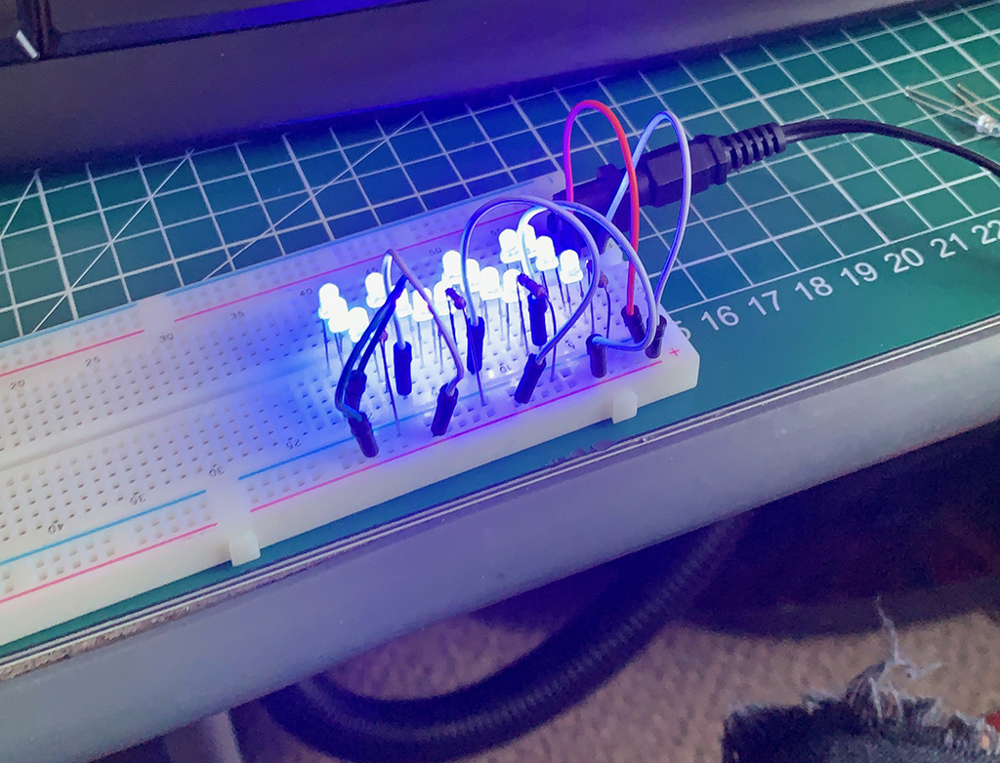
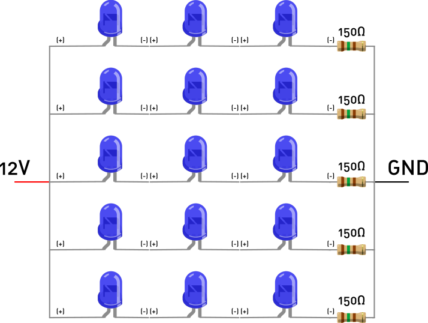

# ESQUEMÁTICOS

Paso #1:

Considerando la alimentación de 12V y el Voltage de los LEDs UV que son de 3V-3.2V según el fabricante ([CHANZON](https://www.amazon.com/stores/Chanzon/Chanzon/page/ED49B7ED-839C-4128-ADC6-BD5D12919F6A)), el esquemático de LEDs se presenta en un circuito paralelo de 3 LEDs por una resistencia de 150Ohm tal como muestra el diagrama 1:

