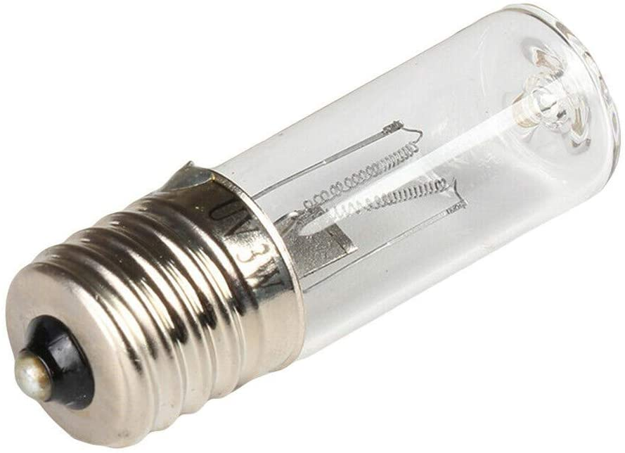

# ESQUEMÁTICOS

NOTA: Antes de comenzar, protege tus ojos con Lentes Oscuros. La luz UV puede ser dañina.

###Paso #1:

Ante los comentarios y aportes, se cambian los LEDs UV-A por una ampolleta UV-C (valor referencia U$6.99), esto reduce los costos y el montaje en cuanto a electrónica se refiere. El principio de una fuente de iluminación se mantiene igual que en el prototipo inicial.

~~Considerando la alimentación de 12V y el Voltage de los LEDs UV que son de 3V-3.2V según el fabricante ([CHANZON](https://www.amazon.com/stores/Chanzon/Chanzon/page/ED49B7ED-839C-4128-ADC6-BD5D12919F6A)), el esquemático de LEDs se presenta en un circuito paralelo de 3 LEDs por una resistencia de 150Ohm tal como muestra el diagrama 1:~~

###Paso #2:

En una caja con tapa (como la que se muestra en los diagramas), forrar las zonas interiores con el papel metálico plateado. ¿Por qué? pues porque la capacidad del papel plateado hará que la luz ultravioleta rebote en todas direcciones al interior de la caja llegando a la mayor cantidad de superficie de las mascarillas.

Utilizar un papel metálico de otro color podría filtrar el elefecto de la luz UV.

###Paso #3:

Una vez forrado el interior, integramos el circuito LED a la tapa. Una alternativa, como la que se ve en la imagen es la de utilizar Cobre Autoadhesivo el cual se adhiere al papel metálico sin problemas permitiendo soltar los cables en su superficie.

Finalmente, según el estudio SETi el baño de luz UV sobre las mascarillas debe ser de 30 segundos tal como se ve en la imagen a continuación.

