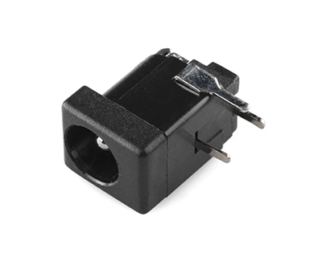
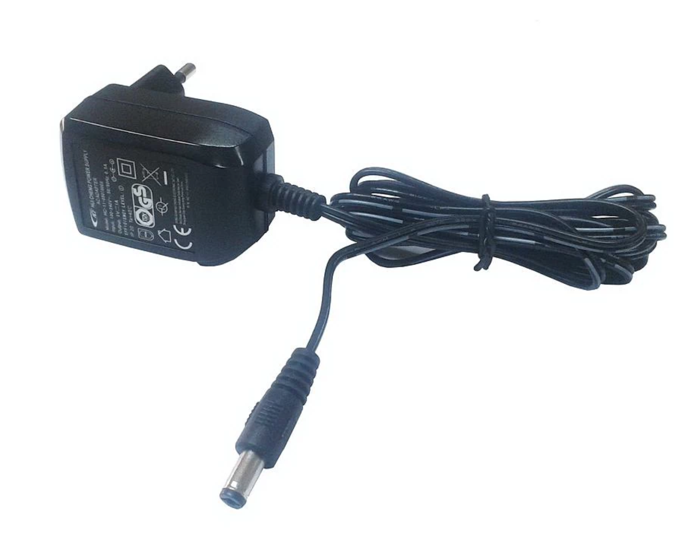
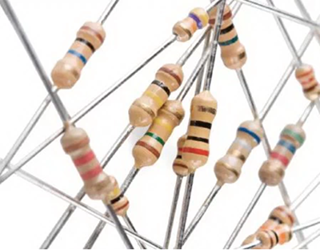
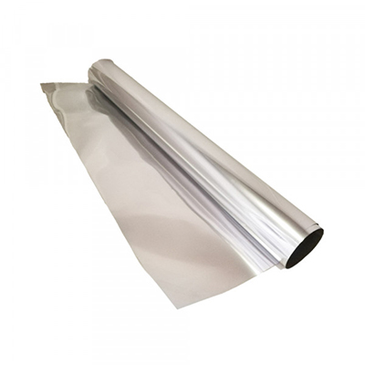
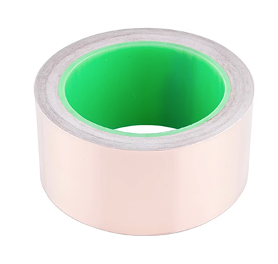

# MATERIALES

Los materiales para el proyecto son:

* 15 LEDs UV 395NM /3mm /3V-3.2V /20 mA (Precio referencia U$0.89)
* 1 Jack DC de Barril (Precio referencia U$0.70)

* Transformador AC/DC 12V (Precio referencia U$9.50)

* 5 Resistencias de 150 Ohm(Ω) (Precio referencia U$0.17)

* Papel Metálico Plateado para regalo (Precio Referencia U$0.43)

Materiales Alternativos:

* Cobre autoadhesivo (Precio referencia U$21.40)

