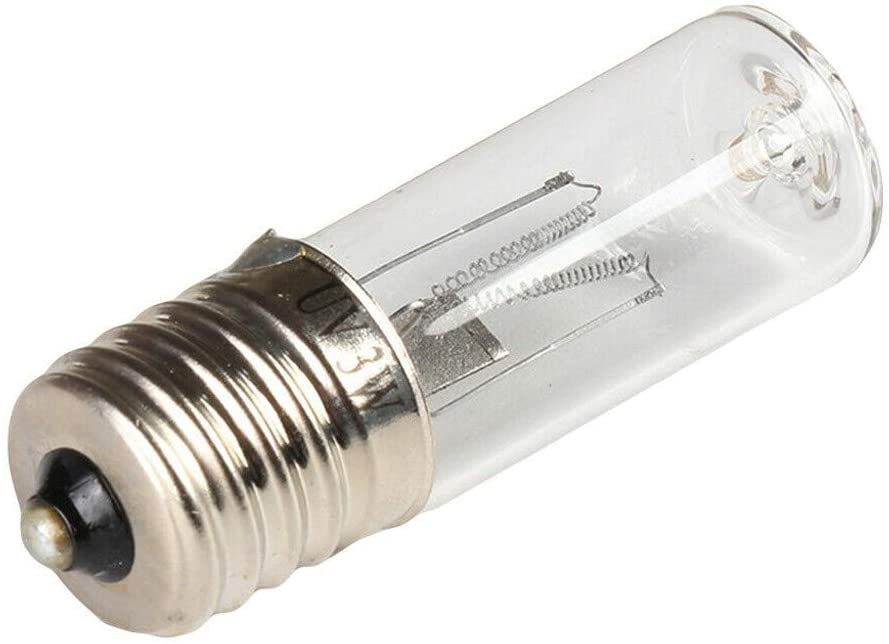

# MATERIALES

Actualización 29 de Abril:

Los materiales para el proyecto son:
* Ampolleta 3W UV-C / funciona a 220V (Precio referencia U$6.99)

* ~~15 LEDs UV 395NM /3mm /3V-3.2V /20 mA (Precio referencia U$0.89)~~
* ~~1 Jack DC de Barril (Precio referencia U$0.70)~~
* Papel Metálico Plateado para regalo (Precio Referencia U$0.43)

Materiales Alternativos:

* Cobre autoadhesivo (Precio referencia U$21.40)

